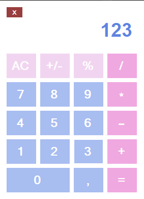

# cpp-calculator_winforms
# Калькулятор WinForms на C++/CLI
Простой калькулятор, разработанный на C++/CLI с использованием Windows Forms.

## Описание

Этот калькулятор позволяет выполнять основные арифметические операции: сложение, вычитание, умножение, деление и вычисление процента. Он имеет интуитивно понятный графический интерфейс, созданный с использованием WinForms.

##Скриншот

## Возможности

*   Поддержка основных арифметических операций (+, -, *, /)
*   Вычисление процентов (%)
*   Изменение знака числа (+/-)
*   Ввод чисел с плавающей точкой (десятичная запятая)
*   Обработка ошибки деления на ноль (вывод сообщения об ошибке)
*   Очистка экрана (кнопка AC)

## Технологии

*   C++/CLI (Common Language Infrastructure)
*   Windows Forms (WinForms)
*   Visual Studio Community

## Использование

1.  Откройте решение `WinProba.sln` в Visual Studio.
2.  Скомпилируйте проект в Visual Studio (Debug или Release конфигурация).
3.  Запустите исполняемый файл (`.exe`), расположенный в папке `Debug` или `Release` (в зависимости от выбранной конфигурации).
4.  Используйте кнопки на экране для ввода чисел и выполнения операций.
5.  Нажмите кнопку "=" для вычисления результата.
6.  Нажмите кнопку "AC" для очистки экрана.
